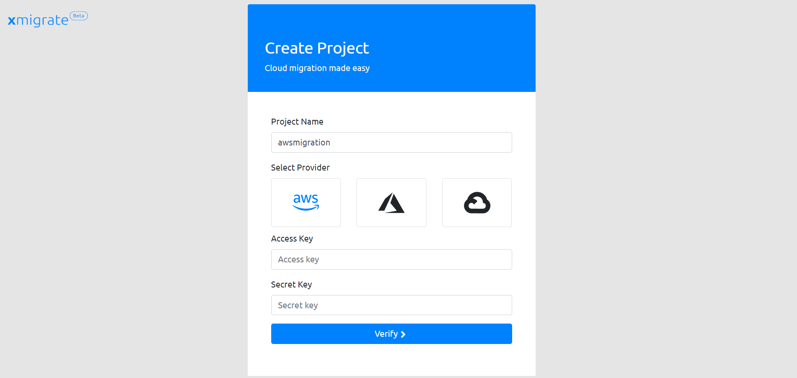
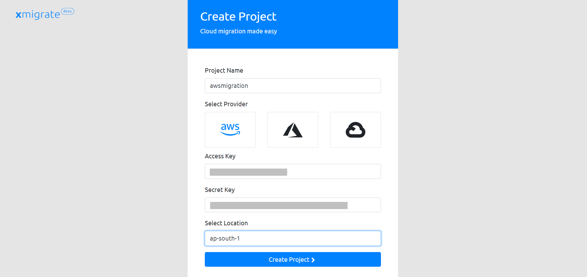

Getting started
===============
.. _getting_started:
.. _setup:
.. _project:
.. _migration:

Setup
-----

Xmigrate can be run easily using the container image from xmigrate docker registry. We reccomend to
run the application with docker compose file which is provided in the application repo.
Also consider changing the credentials used for mongodb in the `docker-compose.yaml` file and provide
the correct IP address of the server where xmigrate is getting setup in `BASE_URL` field. The IP address 
can be private or public but the servers which you want to migrate using xmigrate should have access to this IP.
Here is an example,

.. code-block:: bash

   BASE_URL: http://24.142.113.45:8000/api

Execute below commands to start xmigrate application

.. code-block:: bash

   git clone https://github.com/xmigrate/xmigrate.git
   cd xmigrate
   docker-compose up -d

Execute the below command to see the logs from xmigrate app

.. code-block:: bash
   
   docker-compose -f app

Project
-------
.. _aws:

Once the application is up and running the next step is to signup. After signup login to the application using the credentials.
Now, we have to create a project to start the migration. We define the target cloud in this process. 
Below are the detailed steps with screenshots to create project for each cloud provider,

AWS
---
There are 2 pre-requisites to do migration of servers to AWS. We need an s3 bucket and access credentials to the AWS account with
full permission to the bucket and permission to create roles and manage compute instances. This is for creating network and compute
resources in the target cloud while migration. Follow the below steps to create a project for AWS migration,

1. Give a project name and click on AWS logo to set the target cloud as AWS. Then provide the access key and secret key of the target 
   cloud account and click verify.

2. Now you have to choose a region from the dropdown menu. Dropdown will be empty if the provided credentials are wrong. Make sure that
   the selected region and the region where the s3 bucket is created is same.

Migration
---------